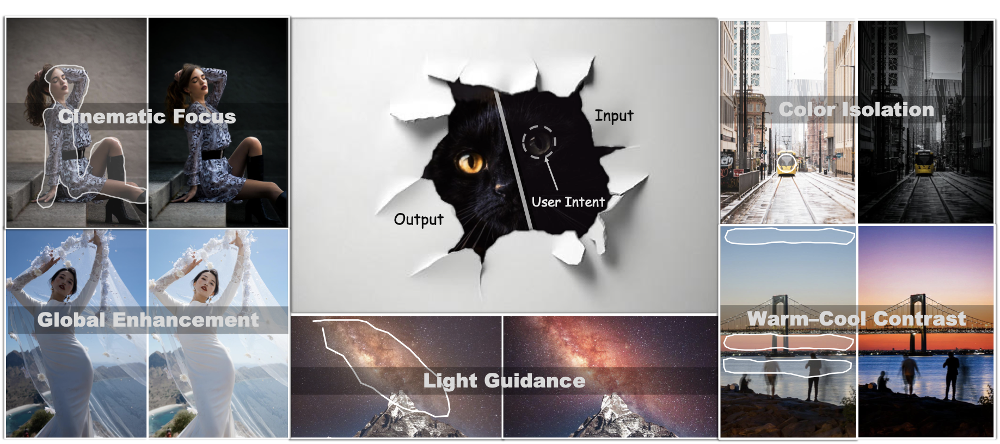

<p align="center">
  
</p>

<p align="center">
  <b>Dotting the Eye: An Intent-Driven Image Retouching Agent for Visual Focus Enhancement</b>
</p>

<p align="center">
  
  <a href="https://arxiv.org/abs/2609.01148">
    
  </a>
<a href="https://huggingface.co/Dragoniss/EyeControl/">
  
</a>
</p>

<div align="center">

[📰 **News**](#news) | [🔧 **Install**](#installation) | [💿 **Models**](#pretrained-models) | [🤖 **Datasets**](#datasets) | [🤖 **Training**](#training) | [📈 **Evaluation**](#evaluation) | [📖 **Citation**](#citation)

</div>

This repository provides the official PyTorch implementation of **EyeControl**, a framework for instruction-based image retouching built on **FLUX.1 Kontext**. EyeControl represents a retouching request with a global instruction for overall color and tone, together with a local instruction and spatial intent for controlling the visual focus.

<p align="center">
  <a href="asset/1_teaser.pdf">
    
  </a>
</p>

## 🚀 Highlights

- **A few clicks. A clear focus.** Tell EyeControl what matters with a click or a rough stroke, and let it bring your subject into the spotlight.
- **Set the mood, keep it natural.** Bring global color and tone together with subtle local adjustments for a look that feels cohesive.
- **Your intent, more ways to shine.** Explore cinematic focus, color isolation, warm–cool contrast, and more—all guided by what you want viewers to notice.

## 📝 TODO List

- [x] Release inference and training code
- [ ] Release ControlArt-Bench and pretrained models
- [ ] Release the data pipeline
- [ ] Release a training subset 
- [ ] Release online demo

<a id="news"></a>
## 📰 News

- **2026-09-01**: Our [paper](https://arxiv.org/abs/2609.01148) is available on arXiv. EyeControl has been accepted to **ECCV 2026**.
- **2026-09-08**: Release inference and training code.

<a id="installation"></a>
## 🔧 Dependencies and Installation

From the repository root, create and activate the environment:

```bash
conda create -n eyecontrol python=3.10 -y
conda activate eyecontrol
pip install -r requirements.txt
```


<a id="pretrained-models"></a>
## 💿 Pretrained Models

| Model | Role | Availability / Local path |
| --- | --- | --- |
| FLUX.1 Kontext dev | Base model | [Hugging Face](https://huggingface.co/black-forest-labs/FLUX.1-Kontext-dev) → `pretrained/FLUX.1-Kontext-dev` |
| EyeControl | Retouching checkpoint | [Hugging Face](https://huggingface.co/Dragoniss/EyeControl/) → `pretrained/eyecontrol` |

Inference needs both the base model and an EyeControl checkpoint. Until pretrained checkpoints are released, use a checkpoint produced by your own training run.

<a id="datasets"></a>
## 🤖 Data Preparation

EyeControl uses three data preparation pipelines:

| Pipeline | Data preparation | Pipeline release |
| --- | --- | --- |
| Focus Pipeline | Generate global/local instructions and spatial intent from before/after image pairs | TBD |
| Global Pipeline | Generate captions for before/after image pairs, then filter the samples | TBD |
| Local Pipeline | Build local retouching data through manual selection and annotation | TBD |

See the [Data Preparation guide(TBD)](docs/data_pipeline.md) for pipeline details.

<a id="training"></a>
## 🤖 Training EyeControl

Prepare the training manifests, then update the dataset paths in
[configs/train.yaml](configs/train.yaml). The configuration contains three groups:

| Group | Training data |
| --- | --- |
| `focus` | Focus retouching samples with weak user intent |
| `global` | Global retouching samples |
| `local` | Local control samples |

Set the base model and output paths in [train.sh](train.sh), then launch training:

```bash
bash train.sh
```

Additional training arguments can be passed through the launcher, for example:

```bash
bash train.sh --max_train_steps 20000 --checkpointing_step 1000
```

If you change the training schedule or output directory, update the checkpoint paths in `infer.sh` accordingly.

<a id="evaluation"></a>
## 📈 Evaluation

After inference finishes, run the following scripts from the repository root:

```bash
# Image quality and saliency metrics
bash scripts/evaluation/pyiqa/pyiqa_intent.sh

# MLLM assessment (FA, PQ, and O; requires a running vLLM server)
bash scripts/evaluation/mllm/evaluation_intent_4metrics.sh
```

See the [Evaluation guide](docs/evaluation.md) for environment setup, reference images, vLLM server configuration, and output paths.

<a id="citation"></a>
## 📖 Citation

If you find EyeControl useful in your research, please cite our [paper](https://arxiv.org/abs/2609.01148):

```bibtex
@article{qin2026dotting,
  title={Dotting the Eye: An Intent-Driven Image Retouching Agent for Visual Focus Enhancement},
  author={Qin, Chujie and Zhang, Zilong and Chang, Zewei and Guo, Chunle and Wang, Ruixing and Hu, Tao and Cheng, Ming-Ming and Li, Chongyi},
  journal={arXiv preprint arXiv:2609.01148},
  year={2026},
  url={https://arxiv.org/abs/2609.01148}
}
```

## 🤝 Acknowledgements

This project builds on
[FLUX.1 Kontext](https://huggingface.co/black-forest-labs/FLUX.1-Kontext-dev),
[Diffusers](https://github.com/huggingface/diffusers), and
[TransalNet](https://github.com/LJOVO/TranSalNet).
We thank their authors and contributors for their open-source work.
